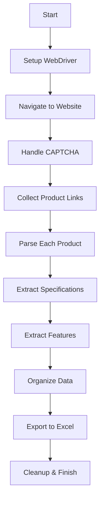

# 🏁 Method Race Wheels Scraping Project

<div align="center">


*An automated web scraping solution for extracting comprehensive product data from Method Race Wheels website*

[Features](#-features) • [Installation](#-installation) • [Usage](#-usage) • [Output](#-output) • [Contributing](#-contributing)

</div>

---

## 📋 Table of Contents

- [🎯 Overview](#-overview)
- [✨ Features](#-features)
- [🛠️ Installation](#️-installation)
- [🚀 Usage](#-usage)
- [📊 Output Format](#-output-format)
- [🔧 Configuration](#-configuration)
- [📁 Project Structure](#-project-structure)
- [🤝 Contributing](#-contributing)
- [📄 License](#-license)

---

## 🎯 Overview

The **Method Race Wheels Scraping Project** is a sophisticated Python-based web scraper designed to automatically extract detailed product information from the Method Race Wheels website. This tool efficiently collects wheel specifications, product descriptions, and technical details, organizing them into a structured Excel format for easy analysis and inventory management.

### 🎪 What Makes This Special?

- **🔄 Dynamic Content Handling**: Adapts to varying product page structures
- **🛡️ CAPTCHA Integration**: Manual CAPTCHA solving with automated continuation
- **📈 Smart Data Organization**: Intelligent column ordering and duplicate removal
- **🎨 Excel Formatting**: Auto-fitted columns with professional presentation
- **🔍 Comprehensive Extraction**: Captures specifications, descriptions, and bullet points

---

## ✨ Features

### 🚀 Core Functionality

| Feature | Description |
|---------|-------------|
| **Multi-Page Scraping** | Automatically discovers and processes all product links |
| **Dynamic Parsing** | Adapts to different product page layouts and structures |
| **Specification Extraction** | Captures wheel diameter, width, bolt pattern, offset, and more |
| **Bullet Point Collection** | Organizes product features into numbered bullet columns |
| **Data Validation** | Cleans and validates extracted data for consistency |
| **Excel Export** | Professional Excel output with auto-fitted columns |

### 🛠️ Technical Features

- **SeleniumBase Integration** for robust web automation
- **Intelligent Element Detection** with multiple fallback selectors
- **Memory Management** with automatic cleanup of temporary files
- **Process Management** with Chrome process cleanup
- **Error Handling** with comprehensive logging
- **Duplicate Detection** and removal

---

## 🛠️ Installation

### Prerequisites

- Python 3.8 or higher
- Chrome browser installed
- Windows/macOS/Linux operating system

### Step-by-Step Setup

1. **Clone the Repository**
   ```bash
   git clone https://github.com/marklumba/method-race-wheels-scraping-project.git
   cd method-race-wheels-scraping-project
   ```

2. **Create Virtual Environment**
   ```bash
   python -m venv .venv
   
   # Windows
   .venv\Scripts\activate
   
   # macOS/Linux
   source .venv/bin/activate
   ```

3. **Install Dependencies**
   ```bash
   pip install seleniumbase pandas xlwings psutil
   ```

4. **Verify Installation**
   ```bash
   python method_race_wheels_scrape.py --help
   ```

---

## 🚀 Usage

### Quick Start

1. **Run the Scraper**
   ```bash
   python method_race_wheels_scrape.py
   ```

2. **Handle CAPTCHA**
   - The browser will open automatically
   - Solve any CAPTCHA that appears
   - Press Enter in the terminal to continue

3. **Monitor Progress**
   - Watch real-time scraping progress in the terminal
   - Check the generated log file for detailed information

4. **Access Results**
   - Find the Excel file on your desktop
   - Filename format: `method_race_wheels_sample_scrape_data_YYYY_MM_DD.xlsx`

### 📊 Sample Output

```
🔍 Scraping Method Race Wheels...
✅ Found 156 unique product links.
📄 Parsing product 1/156: https://www.methodracewheels.com/products/315-machined...
✅ Parsed: 12 fields - ['Overview', 'Part Number', 'Wheel Diameter (in)', ...]
📊 Scraping complete. 156 links found, 156 products parsed.
📁 Excel file saved: C:\Users\Desktop\method_race_wheels_sample_scrape_data_2024_10_28.xlsx
```

---

## 📊 Output Format

The scraper generates a comprehensive Excel file with the following structure:

### 📋 Column Organization

| Column Group | Columns | Description |
|--------------|---------|-------------|
| **Overview** | Overview | Product description and key features |
| **Specifications** | Part Number, Wheel Diameter, Width, Bolt Pattern, Offset, Hub Bore, Back Spacing, Weight, Max Load | Technical specifications |
| **Features** | Bullet 1, Bullet 2, Bullet 3, ... | Product features and highlights |
| **Additional** | Any other dynamically discovered fields | Extra product information |

### 📈 Sample Data Structure

```
| Overview | Part Number | Wheel Diameter (in) | Bullet 1 | Bullet 2 |
|----------|-------------|---------------------|----------|----------|
| A fresh take on the 315 Standard... | MR315785601600 | 17 | Beadlock-inspired styling | High-performance finish |
```

---

## 🔧 Configuration

### 🎛️ Customizable Settings

```python
# Constants in method_race_wheels_scrape.py
WEBSITE_URL = "https://www.methodracewheels.com/"
CAPTCHA_WAIT_TIME = 500
ELEMENT_WAIT_TIME = 50
PAGE_LOAD_WAIT_TIME = 50
```

### 🎯 Target Collections

Currently configured to scrape:
- Standard Wheels Collection
- All product variants and specifications
- Dynamic content and features

---

## 📁 Project Structure

```
method-race-wheels-scraping-project/
│
├── 📄 method_race_wheels_scrape.py    # Main scraping script
├── 📄 README.md                       # Project documentation
├── 📄 requirements.txt                # Python dependencies
├── 📁 .venv/                         # Virtual environment
├── 📄 methodracewheels_automation.log # Execution logs
└── 📁 downloaded_files/               # Temporary files
```

---

## 🔍 How It Works

### 🔄 Scraping Process



### 🎯 Data Extraction Strategy

1. **Link Discovery**: Scrolls through collection pages to find all product URLs
2. **Dynamic Parsing**: Uses multiple CSS selectors to handle varying page structures
3. **Content Extraction**: Separates specifications from feature descriptions
4. **Data Organization**: Maintains consistent column ordering across all products
5. **Quality Control**: Removes duplicates and validates data integrity

---

## 🤝 Contributing

We welcome contributions! Here's how you can help:

### 🐛 Bug Reports
- Use GitHub Issues to report bugs
- Include detailed steps to reproduce
- Provide system information and error logs

### 💡 Feature Requests
- Suggest new features via GitHub Issues
- Explain the use case and expected behavior
- Consider implementation complexity

### 🔧 Pull Requests
1. Fork the repository
2. Create a feature branch
3. Make your changes
4. Add tests if applicable
5. Submit a pull request

---

## 📄 License

This project is licensed under the MIT License - see the [LICENSE](LICENSE) file for details.

---

## 🙏 Acknowledgments

- **SeleniumBase** for robust web automation capabilities
- **Pandas** for efficient data manipulation
- **xlwings** for Excel formatting and automation
- **Method Race Wheels** for providing detailed product information

---

## 📞 Support

Having issues? We're here to help!

- 📧 **Email**: [your-email@example.com]
- 🐛 **Issues**: [GitHub Issues](https://github.com/marklumba/method-race-wheels-scraping-project/issues)
- 💬 **Discussions**: [GitHub Discussions](https://github.com/marklumba/method-race-wheels-scraping-project/discussions)

---

<div align="center">

**⭐ Star this repository if you found it helpful!**

Made with ❤️ by [Mark Lumba](https://github.com/marklumba)

</div>